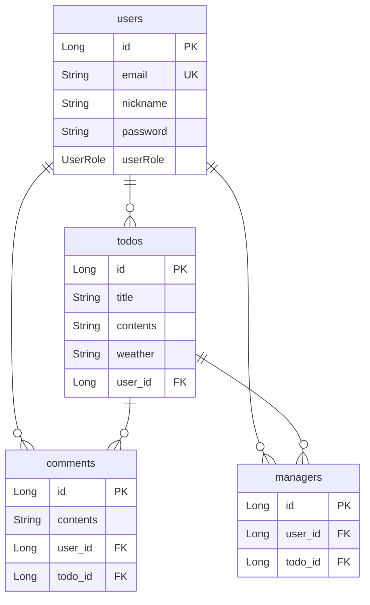

# SPRING PLUS
# 🚀 SPRING PLUS

일정 관리 API 과제입니다.

주어진 코드베이스의 결함을 단계적으로 수정하고, **JPA 최적화 및 Spring Security 기반 인증/인가 기능**을 추가했습니다.

---

## 🛠️ 환경

| 항목          | 버전                        |
| ----------- | ------------------------- |
| Java        | 17                        |
| Spring Boot | 3.3.3                     |
| DB          | MySQL (H2 연동 가능)          |
| ORM         | Spring Data JPA, QueryDSL |
| 인증          | JWT + Spring Security     |

### 실행

```bash
./gradlew bootRun
```

---

## 🗂️ ERD



---

# 📌 작업 내용

## Level 1. 필수 기능 개선 및 추가

### Level 1-1. `@Transactional` 누락 해결

`POST /todos` 호출 시 다음과 같은 예외가 발생하여 일정 저장이 불가능한 문제가 있었습니다.

> `Connection is read-only. Queries leading to data modification are not allowed`

`TodoService` 클래스에 `@Transactional(readOnly = true)`가 선언되어 있어 기본적으로 읽기 전용 트랜잭션이 적용되고 있었습니다.

하지만 `saveTodo()`는 데이터를 저장하는 쓰기 작업이므로 별도의 `@Transactional`을 선언하여 **클래스 레벨의 `readOnly = true` 설정을 오버라이딩**했습니다.

```java
@Transactional
public TodoSaveResponse saveTodo(
        AuthUser authUser,
        TodoSaveRequest todoSaveRequest
) {
    // ...
}
```

**수정 결과**

* `TodoService`의 조회 메서드는 `readOnly = true` 유지
* `saveTodo()`는 쓰기 가능한 트랜잭션으로 동작
* `POST /todos` 일정 생성 정상 처리

---

### Level 1-2. JWT에 닉네임(`nickname`) 추가

기존 JWT에는 사용자 식별에 필요한 정보가 포함되어 있었지만, 프론트엔드에서 닉네임을 사용하기 위해 별도의 사용자 조회가 필요했습니다.

이를 개선하기 위해 **JWT Payload에 `nickname` 클레임을 추가**했습니다.

닉네임은 중복이 가능하도록 정책을 설정했기 때문에 엔티티에 별도의 `unique = true` 제약조건은 적용하지 않았습니다.

```java
return BEARER_PREFIX +
        Jwts.builder()
                .setSubject(String.valueOf(userId))
                .claim("email", email)
                .claim("userRole", userRole)
                .claim("nickname", nickname)
                // ...
```

**수정 결과**

JWT만으로 다음 사용자 정보를 확인할 수 있습니다.

* `userId`
* `email`
* `userRole`
* `nickname`

---

### Level 1-3. JPQL을 활용한 동적 검색 조건 처리

일정 목록 조회 API인 `GET /todos`에 다음 검색 조건을 추가했습니다.

* `weather`
* `startDate`
* `endDate`

각 검색 조건은 선택적으로 전달될 수 있기 때문에, 서비스 계층에서 여러 `if`문으로 조건을 조합하는 대신 **JPQL 내부에서 동적으로 처리**하도록 구성했습니다.

```java
@Query("SELECT t FROM Todo t LEFT JOIN FETCH t.user u " +
        "WHERE (:weather IS NULL OR t.weather = :weather) " +
        "AND (:startDate IS NULL OR t.modifiedAt >= :startDate) " +
        "AND (:endDate IS NULL OR t.modifiedAt <= :endDate) " +
        "ORDER BY t.modifiedAt DESC")
```

파라미터가 `NULL`인 경우 `IS NULL` 조건이 `TRUE`가 되도록 하여 해당 검색 조건을 적용하지 않는 방식입니다.

**수정 결과**

예를 들어 다음과 같이 검색할 수 있습니다.

```text
GET /todos?weather=SUNNY
GET /todos?startDate=2026-01-01
GET /todos?startDate=2026-01-01&endDate=2026-01-31
GET /todos?weather=SUNNY&startDate=2026-01-01&endDate=2026-01-31
```

---

### Level 1-4. 실패하는 컨트롤러 테스트 수정

`TodoControllerTest`의

`todo_단건_조회_시_todo가_존재하지_않아_예외가_발생한다()`

테스트가 실제 애플리케이션의 예외 처리 방식과 일치하지 않아 실패하는 문제가 있었습니다.

Todo가 존재하지 않는 경우 `InvalidRequestException`이 발생하며, `GlobalExceptionHandler`에서 해당 예외를 처리하여 **HTTP 400 BAD_REQUEST**를 반환하도록 구현되어 있습니다.

따라서 테스트의 기대 응답을 실제 시스템 동작에 맞게 수정했습니다.

```java
mockMvc.perform(get("/todos/{todoId}", todoId))
        .andExpect(status().isBadRequest())
        .andExpect(jsonPath("$.status").value(HttpStatus.BAD_REQUEST.name()))
        .andExpect(jsonPath("$.code").value(HttpStatus.BAD_REQUEST.value()))
        .andExpect(jsonPath("$.message").value("Todo not found"));
```

**수정 결과**

* 기존 테스트의 `200 OK` 기대값 제거
* 실제 예외 처리 결과인 `400 BAD_REQUEST` 검증
* HTTP 상태 코드 및 응답 메시지까지 함께 검증

---

### Level 1-5. AOP 로깅 환경 이관

관리자 권한 변경 시 동작하는 `AdminAccessLoggingAspect`가 Spring Security 적용 이후에도 정상적으로 동작하도록 수정했습니다.

기존에는 `HttpServletRequest`에 인증 정보를 저장하고 Aspect에서 이를 가져오는 방식이었습니다.

Spring Security 적용 이후 인증 정보가 `SecurityContext`의 `Authentication` 객체에 저장되도록 변경되었기 때문에, Aspect에서도 **`SecurityContextHolder`를 통해 현재 인증된 관리자 정보를 조회**하도록 수정했습니다.

```java
@Before("execution(* org.example.expert.domain.user.controller.UserAdminController.changeUserRole(..))")
public void logBeforeChangeUserRole(JoinPoint joinPoint) {

    Authentication authentication =
            SecurityContextHolder.getContext().getAuthentication();

    String userId = String.valueOf(
            ((AuthUser) authentication.getPrincipal()).getId()
    );

    // ...
}
```

**수정 결과**

* 인증 정보 조회 위치를 `HttpServletRequest` → `SecurityContext`로 변경
* Spring Security 기반 인증 구조와 AOP 로깅 구조 연계
* 관리자 권한 변경 작업에 대한 로깅 정상 동작

---

# Level 2. JPA 심화 및 Security 전환

## Level 2-6. JPA Cascade를 활용한 담당자 자동 등록

일정을 생성한 사용자는 별도의 요청 없이 해당 일정의 담당자(`Manager`)로 자동 등록되어야 합니다.

기존 `Todo` 생성 과정에서 작성자를 `Manager` 리스트에 추가하고 있었지만, `Todo` 저장 시 `Manager` 엔티티가 함께 저장되지 않는 문제가 있었습니다.

이를 해결하기 위해 `Todo`와 `Manager`의 연관관계에 **`CascadeType.PERSIST`**를 적용했습니다.

```java
@OneToMany(
        mappedBy = "todo",
        cascade = CascadeType.PERSIST
)
private List<Manager> managers = new ArrayList<>();
```

이제 `Todo`를 저장하면 해당 `Todo`의 `managers` 컬렉션에 추가된 `Manager` 엔티티도 함께 `INSERT`됩니다.

**수정 결과**

```text
Todo 생성
  ↓
작성자를 Manager에 추가
  ↓
Todo 저장
  ↓
CascadeType.PERSIST
  ↓
Manager 자동 저장
```

별도의 `ManagerRepository.save()` 호출 없이도 담당자 등록이 이루어지도록 개선했습니다.

---

## Level 2-7. 댓글 조회 N+1 문제 해결 (JPQL)

댓글 목록 조회 API에서 연관된 사용자 정보를 가져오는 과정에서 **N+1 문제가 발생**했습니다.

기존에는 댓글 목록을 조회한 이후 각 댓글의 `User` 정보를 조회하면서 댓글 개수만큼 추가 쿼리가 발생할 수 있었습니다.

이를 해결하기 위해 일반 `JOIN` 대신 **`JOIN FETCH`**를 사용하도록 수정했습니다.

```java
@Query("""
    SELECT c
    FROM Comment c
    JOIN FETCH c.user
    WHERE c.todo.id = :todoId
""")
List<Comment> findByTodoIdWithUser(
        @Param("todoId") Long todoId
);
```

`JOIN FETCH`를 사용하면 댓글과 연관된 `User` 엔티티를 하나의 쿼리에서 함께 조회할 수 있습니다.

**수정 결과**

```text
기존
댓글 조회 1회
+ User 조회 N회
= N+1개의 쿼리

개선
댓글 + User 조회 1회
= 1개의 쿼리
```

---

## Level 2-8. 단건 조회 N+1 문제 해결 (QueryDSL)

기존 JPQL 기반의 `findByIdWithUser()` 조회 로직을 **QueryDSL 기반으로 이관**했습니다.

단건 조회에서도 연관된 `User`를 함께 조회할 수 있도록 `fetchJoin()`을 적용했습니다.

```java
@Override
public Optional<Todo> findByIdWithUser(Long todoId) {

    Todo result = queryFactory
            .selectFrom(todo)
            .leftJoin(todo.user, user)
            .fetchJoin()
            .where(todo.id.eq(todoId))
            .fetchOne();

    return Optional.ofNullable(result);
}
```

`fetchJoin()`을 적용하여 `Todo` 조회 시 연관된 `User`를 함께 조회하도록 구성했습니다.

**수정 결과**

* JPQL 기반 조회 로직을 QueryDSL로 이관
* 연관된 `User`에 대한 추가 조회 방지
* QueryDSL의 동적 쿼리 작성 기반 마련
* `fetchJoin()`을 통한 연관 엔티티 즉시 조회

---

## Level 2-9. Spring Security 도입 및 Argument Resolver 리팩토링

기존에는 커스텀 `Filter`와 `ArgumentResolver`를 이용하여 JWT 인증/인가를 처리하고 있었습니다.

이를 **Spring Security 기반의 인증/인가 구조로 전환**했습니다.

JWT를 사용하는 토큰 기반 인증 방식 자체는 유지하면서, 인증 정보의 저장과 권한 관리는 Spring Security의 구조를 활용하도록 변경했습니다.

### 1. SecurityConfig 구성

`SecurityConfig`를 통해 URL별 접근 권한을 명확하게 분리했습니다.

* `/auth/**` → 인증 없이 접근 가능
* `/admin/**` → `ADMIN` 권한 필요
* 그 외 API → 인증 필요

기존 `JwtSecurityFilter`에 집중되어 있던 인증/인가 책임을 **JWT 인증과 Spring Security의 권한 관리로 분리**했습니다.

---

### 2. SecurityContext로 인증 정보 이관

기존에는 JWT에서 추출한 인증 정보를 `HttpServletRequest`에 저장했습니다.

Spring Security 적용 이후에는 인증 정보를 `Authentication` 객체로 구성하고, `SecurityContextHolder`에 저장하도록 변경했습니다.

```text
JWT
 ↓
JwtSecurityFilter
 ↓
JWT 검증 및 사용자 정보 추출
 ↓
Authentication 생성
 ↓
SecurityContextHolder 저장
 ↓
Controller / Service / AOP에서 인증 정보 사용
```

---

### 3. Argument Resolver 리팩토링

기존 컨트롤러의 메서드 시그니처를 변경하지 않고 기존 방식과 동일하게 사용할 수 있도록 `AuthUserArgumentResolver`를 리팩토링했습니다.

기존 컨트롤러:

```java
@Auth AuthUser authUser
```

컨트롤러의 사용 방식은 그대로 유지하면서, 내부적으로 인증 정보를 가져오는 위치만 `HttpServletRequest`에서 `SecurityContext`로 변경했습니다.

```java
Authentication authentication =
        SecurityContextHolder.getContext().getAuthentication();

return (AuthUser) authentication.getPrincipal();
```

**수정 결과**

* 기존 컨트롤러 코드 변경 최소화
* 인증 정보 저장 위치를 Spring Security의 `SecurityContext`로 통일
* JWT 인증과 Spring Security 권한 관리 연계
* `ArgumentResolver`를 통한 `@Auth AuthUser` 사용 방식 유지
* 인증/인가 책임을 각 계층의 역할에 맞게 분리

---

# 📚 주요 개선 사항 정리

| Level     | 작업               | 주요 내용                                         |
| --------- | ---------------- | --------------------------------------------- |
| Level 1-1 | `@Transactional` | 읽기 전용 트랜잭션으로 인한 저장 오류 해결                      |
| Level 1-2 | JWT 닉네임          | JWT에 `nickname` 클레임 추가                        |
| Level 1-3 | 동적 검색            | JPQL을 활용한 조건부 일정 검색                           |
| Level 1-4 | 테스트 수정           | 실제 예외 처리 결과에 맞게 테스트 수정                        |
| Level 1-5 | AOP 로깅           | Spring Security `SecurityContext` 기반 인증 정보 조회 |
| Level 2-6 | JPA Cascade      | `CascadeType.PERSIST`를 활용한 담당자 자동 등록          |
| Level 2-7 | N+1 최적화          | `JOIN FETCH`를 활용한 댓글 조회 최적화                   |
| Level 2-8 | QueryDSL         | `fetchJoin()`을 활용한 Todo 단건 조회 최적화             |
| Level 2-9 | Spring Security  | JWT 인증 구조를 Spring Security 기반으로 전환            |

---

## 💡 핵심 기술 포인트

### Transaction

* 클래스 레벨 `@Transactional(readOnly = true)` 활용
* 쓰기 작업에 대한 메서드 단위 `@Transactional` 적용

### JPA

* `CascadeType.PERSIST`
* `JOIN FETCH`
* `fetchJoin()`
* N+1 문제 해결

### QueryDSL

* QueryDSL 기반 Repository Custom 구현
* `fetchJoin()`을 활용한 연관 엔티티 조회

### Spring Security

* JWT 기반 인증
* `SecurityContextHolder`
* `Authentication`
* URL 기반 접근 권한 설정
* `ADMIN` 권한 인가

### AOP

* 관리자 권한 변경 로깅
* `SecurityContext` 기반 인증 사용자 정보 활용

